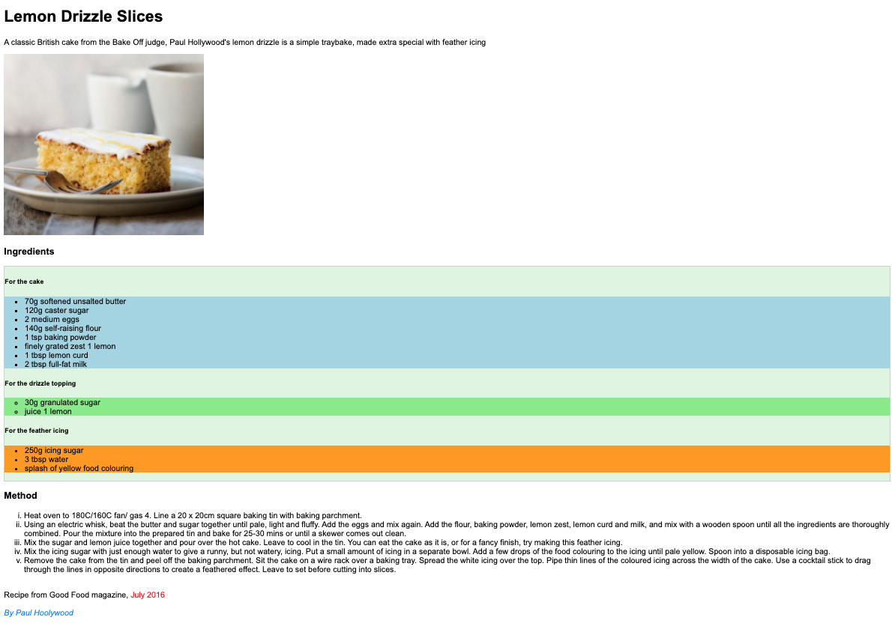

# Lemon Drizzle Recipe

Single webpage about Lemon Drizzle Slices Recipe

## Instructions

- Add favicon in head of document
- Add a title to the document
- You can get text content from `content.txt` file
- Add a base tag to the document, in order for the links to open in a new tab.
- When hovering over links, their text color should change to **green**
- Please just code what you see, neither less nor more.

## The desktop overview

## The online version

In order to see live version, just [click...!](https://hsnakk.github.io/UIB_Content_Exercise-2/)

[//]: # (autograding info start)
#  Results
> ⌛ Give it a minute. As long as you see the orange dot  on top, CodeBuddy is still processing. Refresh this page to see it's current status.
>
> This is what CodeBuddy found when running your code. It is to show you what you have achieved and to give you hints on how to complete the exercise.

### Favicon

|                 Status                  | Check                                                                                    |
| :-------------------------------------: | :--------------------------------------------------------------------------------------- |
|  | Page should contain `favicon` icon from the `images` folder  |

### Title

|                 Status                  | Check                                                                                    |
| :-------------------------------------: | :--------------------------------------------------------------------------------------- |
|  | `title` tag should be in the document and should not be empty |

### Head

|                 Status                  | Check                                                                                    |
| :-------------------------------------: | :--------------------------------------------------------------------------------------- |
|  | `HEAD` tag should contain a `base` tag with target attribute set to `_blank` |

### Anchor Tags

|                 Status                  | Check                                                                                    |
| :-------------------------------------: | :--------------------------------------------------------------------------------------- |
|  | Anchor tags on page should change color on hover |

[🔬 Results Details](../../actions)
[🐞 Tips on Debugging](https://github.com/DCI-EdTech/autograding-setup/wiki/How-to-work-with-CodeBuddy)
[📢 Report Problem](https://docs.google.com/forms/d/e/1FAIpQLSfS8wPh6bCMTLF2wmjiE5_UhPiOEnubEwwPLN_M8zTCjx5qbg/viewform?usp=pp_url&entry.652569746=UIB-content-lemon-drizzle)

[//]: # (autograding info end)