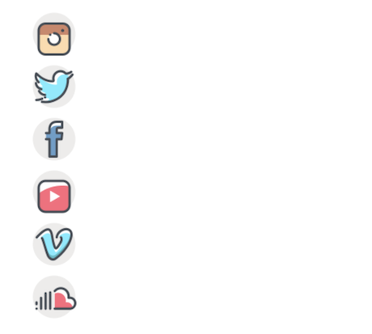

# Basic HTML Exercises

## Exercise: Beyonce's Publicist

**Instructions**:

Beyonce's publicist hired you to create a social media link list for Beyonce herself! Your faithful designer has quickly created these little social media icons for you and put them online. All you need to do now is create a series of icons that link to all of Beyonce's social media profiles.

1. Use the list of resources in the HTML file to create an **unordered list** of **image links** that contains a **link** to each of the social media profiles. Each link should **open in a new tab**.

2. Make sure that your CSS removes the dots that a list desplays by default, so only the icons are visible.

3. Add a hover tooltip to each of the links with Beyonce's username on each of the social media platforms.

[//]: # (autograding info start)
#  Results
> ⌛ Give it a minute. As long as you see the orange dot  on top, CodeBuddy is still processing. Refresh this page to see it's current status.
>
> This is what CodeBuddy found when running your code. It is to show you what you have achieved and to give you hints on how to complete the exercise.

### Unordered list

|                 Status                  | Check                                                                                    |
| :-------------------------------------: | :--------------------------------------------------------------------------------------- |
|  | Page should contain an **unordered list** |
|  | Default list dots should not be displayed |

### Links

|                 Status                  | Check                                                                                    |
| :-------------------------------------: | :--------------------------------------------------------------------------------------- |
|  | Anchor tags should have valid `href` attribute, and open in a new tab |

### Icons

|                 Status                  | Check                                                                                    |
| :-------------------------------------: | :--------------------------------------------------------------------------------------- |
|  | Page should contain `img` tags with social media icons |

[🔬 Results Details](../../actions)
[🐞 Tips on Debugging](https://github.com/DCI-EdTech/autograding-setup/wiki/How-to-work-with-CodeBuddy)
[📢 Report Problem](https://docs.google.com/forms/d/e/1FAIpQLSfS8wPh6bCMTLF2wmjiE5_UhPiOEnubEwwPLN_M8zTCjx5qbg/viewform?usp=pp_url&entry.652569746=UIB-content-publicist)

[//]: # (autograding info end)