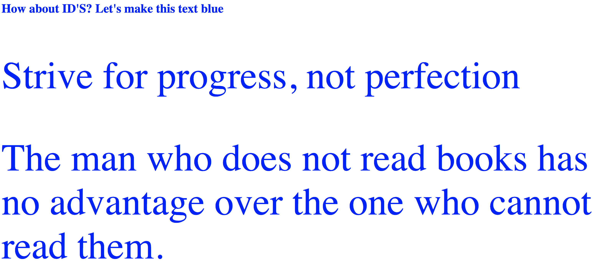

# UI-Basics-Content-Classes&IDs

# Wie sieht es mit ID'S aus?

**Anleitung**:

- Ändere entweder die Klassen oder Id's in der HTML-Datei und füge die entsprechenden Klassen und Id's in der CSS-Datei, die du für diese Übung hast, hinzu oder ändere sie, um sicherzustellen, dass der Text der ganzen Seite nur in der Farbe Blau ist.

**Bonus**:

- Trenne die p-Tags in verschiedenen DIVs.
- Gib jedem DIV entweder eine ID oder eine Klasse.
- Füge eine Hintergrundfarbe zu jedem DIV hinzu.
