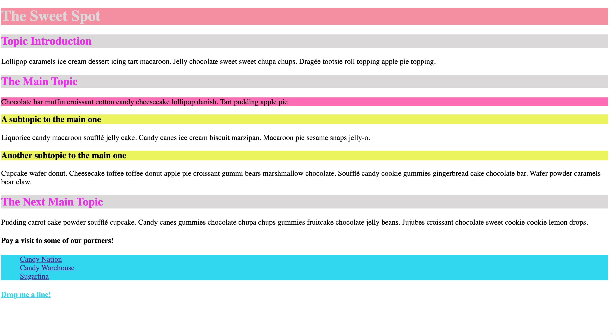

# The Sweet Spot

Create the webpage as shown in the reference image below.

### Instructions

> - Use http://www.cupcakeipsum.com/ for the dummy text
> - Use hex codes to replicate the colors as accurately as possible
> - Classes, IDs and CSS selectors should be used where appropriate
> - You will need to use the pseudo classes `:hover`, `:active` and `:visited`
> - The text under the two **subtopic** headers changes color on `:hover`
> - The links at the bottom of the main page and under **Contact Information** are in lists and change color on `:hover`
> - The web links have an `:active` class applied and should open in a new tab
> - `:visited` pseudo classes should be applied to the internal links, **Drop me a line!** and **Back to main page**

#### Main Page

#### Contact Page

### For further reference, you can check out the live version [here!](https://digitalcareerinstitute.github.io/UIB-content-the-sweet-spot/index.html)

[//]: # (autograding info start)
#  Results
> ⌛ Give it a minute. As long as you see the orange dot  on top, CodeBuddy is still processing. Refresh this page to see it's current status.
>
> This is what CodeBuddy found when running your code. It is to show you what you have achieved and to give you hints on how to complete the exercise.

### HTML structure

|                 Status                  | Check                                                                                    |
| :-------------------------------------: | :--------------------------------------------------------------------------------------- |
|  | HTML file should contain appropriate meta tags |
|  | HTML file should contain a title tag that is not empty |

### CSS

|                 Status                  | Check                                                                                    |
| :-------------------------------------: | :--------------------------------------------------------------------------------------- |
|  | Class and ID selectors should be used where neccesary |
|  | Page should use `:hover` `:visited` `:active` pseudo classes |

### Links

|                 Status                  | Check                                                                                    |
| :-------------------------------------: | :--------------------------------------------------------------------------------------- |
|  | Links should open in a new tab |

### Contact Page

|                 Status                  | Check                                                                                    |
| :-------------------------------------: | :--------------------------------------------------------------------------------------- |
|  | The 'Drop me a line' link Should redirect to `contact.html` page |
|  | Contact Page Should contain a 'go back' link to index.html |
|  | Contact page exists |

[🔬 Results Details](../../actions)
[🐞 Tips on Debugging](https://github.com/DCI-EdTech/autograding-setup/wiki/How-to-work-with-CodeBuddy)
[📢 Report Problem](https://docs.google.com/forms/d/e/1FAIpQLSfS8wPh6bCMTLF2wmjiE5_UhPiOEnubEwwPLN_M8zTCjx5qbg/viewform?usp=pp_url&entry.652569746=UIB-content-the-sweet-spot)

[//]: # (autograding info end)