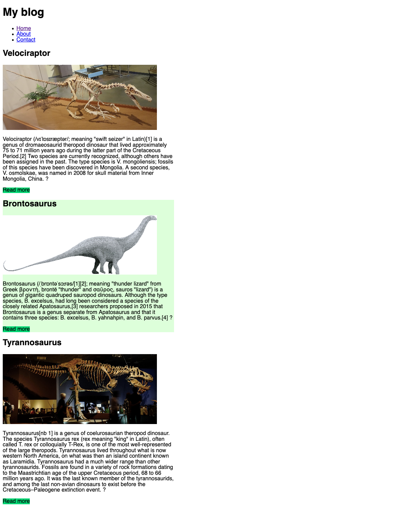
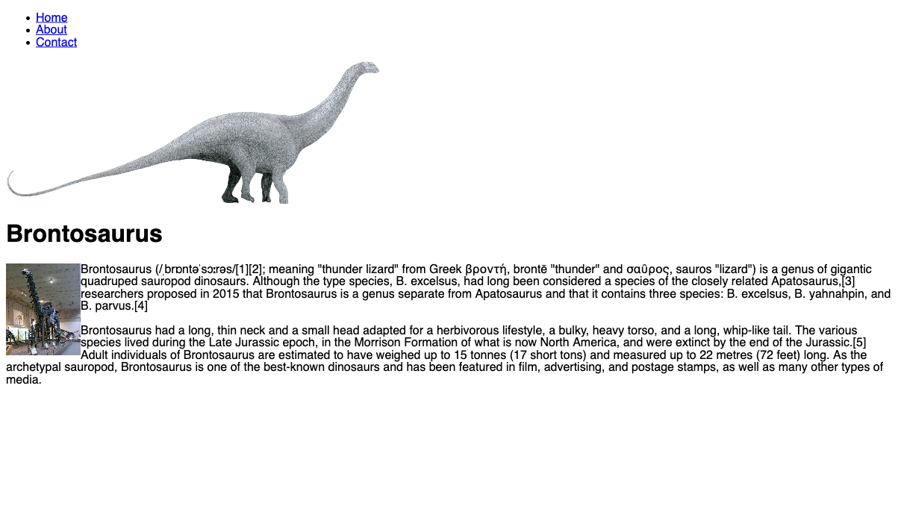

# Build a Blog

- Inside the `posts` directory create a HTML file for each post, named `post-1.html`, `post-2.html` etc. Create at least 3 posts.
- In the `index.html` file list all the posts available, showing the main picture, title, and the first few lines of content. At the end, put a `read more` link that points to the full blog post
- Inside each individual post page, put the main image, the title, the full content and some extra images
- In each individual blog post page, add a 'return to homepage' link.

Notes:

- Copy the content from some wikipedia page, or from whatever source you prefer, but try to give it a theme. Some ideas:
  - a blog about your favourite video games
  - a blog about your favourite tv series
  - a blog about your favourite cartoons or anime
  - a blog about comics
  - a blog about your favourite bands
- Try to use as many things you learned as possile
  - put some floating image in the text
  - add some background color
  - add colored links
- Use the examples below as a reference, but try to come up with your own style ideas

### Homepage

---

### Single post page

---

[//]: # (autograding info start)
#  Results
> ⌛ Give it a minute. As long as you see the orange dot  on top, CodeBuddy is still processing. Refresh this page to see it's current status.
>
> This is what CodeBuddy found when running your code. It is to show you what you have achieved and to give you hints on how to complete the exercise.

### Homepage

|                 Status                  | Check                                                                                    |
| :-------------------------------------: | :--------------------------------------------------------------------------------------- |
|  | Blog homepage should exist |

### Images

|                 Status                  | Check                                                                                    |
| :-------------------------------------: | :--------------------------------------------------------------------------------------- |
|  | Each blog post on the homepage should contain an image from the images folder |

### Post links

|                 Status                  | Check                                                                                    |
| :-------------------------------------: | :--------------------------------------------------------------------------------------- |
|  | Homepage should contain links to blog posts |
|  | Blog post links are pointing to respective post pages |

### Back to Homepage

|                 Status                  | Check                                                                                    |
| :-------------------------------------: | :--------------------------------------------------------------------------------------- |
|  | Blog posts should contain a link back to the homepage |

[🔬 Results Details](../../actions)
[🐞 Tips on Debugging](https://github.com/DCI-EdTech/autograding-setup/wiki/How-to-work-with-CodeBuddy)
[📢 Report Problem](https://docs.google.com/forms/d/e/1FAIpQLSfS8wPh6bCMTLF2wmjiE5_UhPiOEnubEwwPLN_M8zTCjx5qbg/viewform?usp=pp_url&entry.652569746=UIB-content-build-a-blog)

[//]: # (autograding info end)